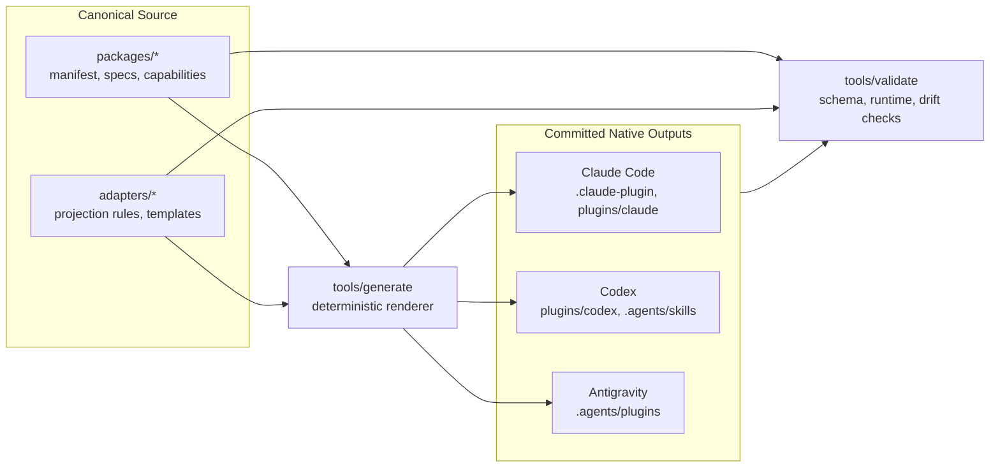
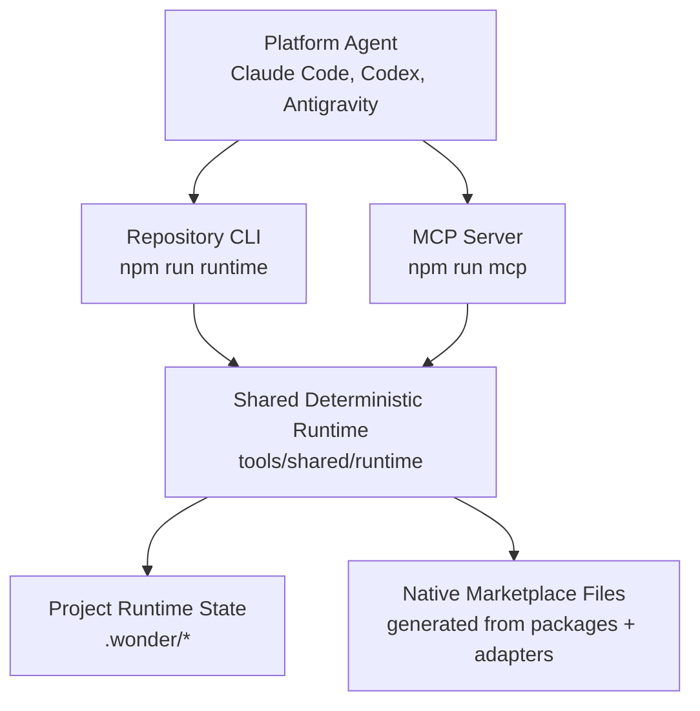

# WonderSolutions

WonderSolutions는 하나의 canonical source에서 Claude Code, Codex, Antigravity용 marketplace/plugin 산출물을 결정적으로 생성하고 검증하는 TypeScript/Node.js 저장소입니다.

사람은 `packages/`와 `adapters/`의 원본만 편집합니다. `plugins/`, `.claude-plugin/`, `.agents/` 아래 산출물은 생성물이지만 commit 대상입니다. 원본을 바꾼 뒤에는 반드시 다시 생성하고 drift를 확인해야 합니다.

## Architecture

GitHub Markdown은 `mermaid` fenced code block을 렌더링합니다. 아래 다이어그램은 GitHub README에서 SVG 다이어그램으로 표시됩니다.





## Products

WonderSolutions는 기술 구성요소가 아니라 사용자의 작업 단위로 plugin을 나눕니다. 각 plugin은 독립 실행 가능해야 하며, 다른 plugin이 init되어 있으면 `.wonder/state.json`의 capability registry를 통해 점진적으로 강화됩니다.

| Package | User Job | Responsibility | Capabilities |
| --- | --- | --- | --- |
| `wonder-build` | Build | 작업 생성, 수정, 리뷰 흐름을 구조화합니다. | `init`, `create`, `modify`, `review` |
| `wonder-govern` | Govern | 프로젝트 기준과 정책 검사를 관리합니다. | `init`, `define-standards`, `check-policy` |
| `wonder-reuse` | Reuse | 재사용 asset과 렌더링된 산출물을 관리합니다. | `init`, `manage-assets`, `generate-output`, `promote-asset` |
| `wonder-extend` | Extend | companion/integration 추천, 설정, capability 감지를 담당합니다. | `init`, `discover-companions`, `configure-integration`, `detect-capabilities` |

Canonical capability id는 `<package-id>.<capability-id>` 형식입니다. Adapter가 플랫폼별 surface name을 생성합니다.

| Canonical ID | Claude Code | Codex | Antigravity |
| --- | --- | --- | --- |
| `wonder-build.create` | `/wonder-build:create` | `$wonder-build-create` | `wonder-build.create` |

## Repository Layout

```text
packages/                 # 사람이 편집하는 product source
  wonder-build/
    manifest.json
    specs/
    capabilities/
      create/
        capability.json
        instruction.md
        design.md
  wonder-govern/
  wonder-reuse/
  wonder-extend/

adapters/                 # 플랫폼별 projection 규칙과 Handlebars templates
  claude/
  codex/
  antigravity/

tools/                    # generator, validator, deterministic runtime, MCP
  generate/
  validate/
  runtime/
  mcp/
  shared/

tests/                    # node:test suites
.githooks/pre-commit      # generate -> validate -> drift gate

.claude-plugin/           # generated Claude marketplace output
plugins/claude/           # generated Claude plugin output
plugins/codex/            # generated Codex plugin output
.agents/plugins/          # generated Antigravity/Codex marketplace output
.agents/skills/           # generated repo-local Codex skills

docs/
  system-design.md
  implementation-design.md
  deterministic-runtime.md
```

## Development

PowerShell에서 `npm.ps1` 실행 정책에 막히면 `npm.cmd`를 사용합니다.

```bash
npm install
npm run check
```

주요 명령:

| Command | Purpose |
| --- | --- |
| `npm run generate` | `packages/`와 `adapters/`에서 native platform output을 다시 생성합니다. |
| `npm run validate` | source, generated output, runtime state를 검증합니다. |
| `npm run drift` | generated output이 canonical source와 일치하는지 확인합니다. |
| `npm run check` | `generate`, `validate`, `drift`를 순서대로 실행합니다. |
| `npm test` | `tests/**/*.test.ts`를 `node:test`/`tsx`로 실행합니다. |
| `npm run typecheck` | TypeScript 타입 검사를 실행합니다. |
| `npm run runtime` | deterministic runtime CLI entrypoint를 실행합니다. |
| `npm run mcp` | deterministic runtime MCP stdio server를 실행합니다. |

특정 플랫폼만 생성하거나 drift만 확인할 수도 있습니다.

```bash
tsx tools/generate/cli.ts --platform claude
tsx tools/generate/cli.ts --platform codex
tsx tools/generate/cli.ts --platform antigravity
tsx tools/generate/cli.ts --dry-run

tsx tools/validate/cli.ts --source
tsx tools/validate/cli.ts --generated --drift
tsx tools/validate/cli.ts --runtime
```

## Change Workflow

1. `packages/<package>/` 또는 `adapters/<platform>/`의 canonical source를 수정합니다.
2. `npm run generate`로 플랫폼별 산출물을 재생성합니다.
3. `npm run validate`와 `npm run drift`로 schema와 drift를 확인합니다.
4. 소스 변경과 생성된 산출물을 함께 stage합니다.
5. commit 전 `npm test`, `npm run typecheck`, `npm run check`를 통과시키는 것을 기본 검증선으로 둡니다.

Generated output은 직접 수정하지 않습니다. 직접 고치면 다음 `generate`에서 덮어써지고 drift gate에서 실패할 수 있습니다.

## Runtime Contract

플랫폼 agent가 판단해야 하는 일과 파일 시스템에 결정적으로 기록해야 하는 일을 분리합니다. `.wonder/**/*.json`, run scaffold, latest report, reuse rendering, generate/validate/drift 같은 작업은 `tools/shared/runtime`의 typed operation을 통해 수행합니다.

CLI와 MCP는 같은 shared runtime implementation을 호출해야 합니다.

```bash
npm run runtime -- list
npm run runtime -- <operation> --json "{\"projectRoot\":\".\"}"
npm run mcp
```

자세한 writer role, preservation rule, operation contract는 [`docs/deterministic-runtime.md`](docs/deterministic-runtime.md)를 기준으로 봅니다.

## Git Hook

pre-commit hook은 생성물이 source와 맞는지 막는 마지막 gate입니다.

```bash
git config core.hooksPath .githooks
```

Hook은 `generate -> validate -> drift`를 실행합니다. 생성 결과가 바뀌어도 hook이 자동으로 `git add`하지 않습니다. 변경된 generated output을 사용자가 확인한 뒤 직접 stage해야 합니다.

## Design References

- [`docs/system-design.md`](docs/system-design.md): 아키텍처 기준 문서
- [`docs/implementation-design.md`](docs/implementation-design.md): 구현 계약과 파일 구조
- [`docs/deterministic-runtime.md`](docs/deterministic-runtime.md): runtime writer와 operation contract
- [`okf-spec.md`](okf-spec.md): runtime knowledge artifact 참고 명세
- [`llm-wiki.md`](llm-wiki.md): LLM-facing documentation 참고 자료
