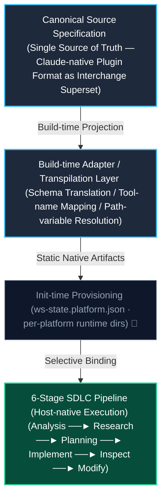
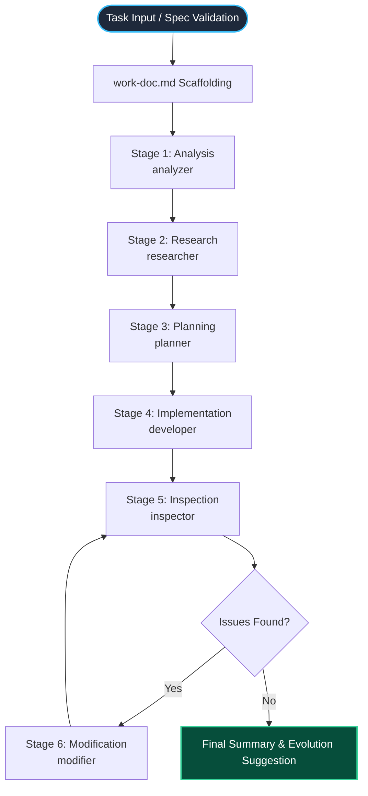
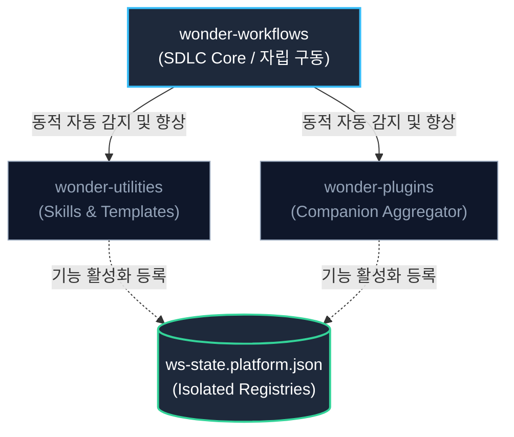

# WonderSolutions Unified System Design Specification

WonderSolutions는 특정 AI 에이전트 CLI 또는 LLM 런타임에 종속되지 않는 **"선언적 멀티 에이전트 오케스트레이션 개발 파이프라인(Declarative Multi-Agent Orchestration Development Pipeline)"** 아키텍처를 정의합니다.

본 설계서는 서로 다른 실행 환경(Runtimes)이 공유하는 **단일 추상 설계 원칙**과 **통합 사양**을 정의하여 시스템의 이식성과 영속성을 보장합니다.

> **구현 상태 범례 (Implementation Status Legend)**
> 본 문서는 설계(목표)와 현재 구현을 명시적으로 구분합니다. 각 항목 옆 표기를 따릅니다.
> - **✅ 구현됨 (Implemented)**: 현재 코드베이스에 존재하고 동작하는 사양.
> - **🚧 로드맵 (Roadmap)**: 설계로 확정되었으나 아직 코드로 구현되지 않은 목표 사양.
> - **⚠️ 갭/수정 대상 (Gap)**: 현재 구현이 설계 의도와 어긋나 정정이 필요한 부분.
>
> 핵심 전제: WonderSolutions는 **자체 런타임을 소유하지 않고 기존 호스트(Claude Code · Codex · Antigravity)에 얹는 플러그인 제품**입니다. 따라서 플랫폼 적응은 **런타임 해석이 아니라 빌드타임 생성(트랜스파일) + init타임 프로비저닝**으로 이루어집니다.

---

## 1. 단일 아키텍처 원칙 (Unified Architecture Principles)

WonderSolutions는 **"선언적 사양(Declarative Specification)과 플랫폼별 산출물(Platform Artifacts)의 결합도를 낮추는 결합 최소화 원칙"**을 최우선으로 합니다.

에이전트의 역할, 행동 지침, 사용할 도구는 실행 플랫폼과 무관하게 데이터로만 기술되며, **빌드타임 어댑터(Build-time Adapter / Transpiler)**가 이 단일 소스를 각 호스트의 네이티브 포맷으로 *생성(transpile)*합니다. 호스트 CLI는 자신의 네이티브 산출물을 그대로 로드·구동할 뿐이며, WonderSolutions가 호스트의 런타임 디스패치 경로에 끼어드는 "런타임 해석기"는 존재하지 않습니다(호스트들이 그러한 확장점을 제공하지 않으므로).



> 정식 소스 `plugins/`(Claude 네이티브 플러그인 포맷)는 agent·command·rule·skill을 모두 1급 타입으로 갖는 **상위집합(superset)**이므로, Codex(전부 skill로 축약)·Antigravity(agent+workflow+rule+skill)로의 투영은 모두 이 상위집합에서 *아래로* 생성하는 손실 없는 하위 투영입니다.

---

## 2. 핵심 설계 원칙 (Core Design Principles)

### 2.1. 원칙 A. 단일 진실 공급원 (Single Source of Truth)
* 모든 에이전트 페르소나(`agents/`), 워크플로우 명세(`commands/`), 제약 조건(`rules/`)은 YAML Frontmatter를 포함한 표준 마크다운(Markdown) 포맷으로만 관리합니다.
* **정식 소스(Canonical Source)는 `plugins/`(Claude 네이티브 플러그인 포맷)이며, 이를 플랫폼 중립 상위집합 교환 포맷(Interchange Superset)으로 취급합니다.** 별도의 중립 포맷을 따로 두지 않고, 가장 표현력이 풍부한 Claude 포맷을 정식 소스로 삼아 타 플랫폼 산출물을 *여기서 생성*합니다. (✅ 현재 `sync-agents.js`·`npm run validate` 모두 `plugins/`를 기준으로 동작)
* 사양의 변경은 오직 이 정식 소스에서만 발생해야 하며, 타 플랫폼 산출물(`.agents/`, `codex/plugins/` 등)은 직접 손으로 수정하지 않고 **빌드타임 생성으로만 갱신**합니다. (⚠️ 현재 Codex 레이어는 수작업 유지 중 — 정식 소스 생성으로 전환 필요. [Q3 갭])

### 2.2. 원칙 B. 빌드타임 어댑터 인터페이스 (Build-time Adapter Interface)
* 각 플랫폼 어댑터는 정식 소스를 읽어 해당 호스트의 네이티브 포맷으로 *생성(transpile)*하는 빌드타임 인터페이스를 구현합니다. (✅ Antigravity: `scripts/sync-agents.js`)
* 어댑터는 빌드/init 시점에 검증(Validation), 스키마 변환(Translation), 경로 변수 해석(Path Resolution), 동기화(Synchronization)를 수행합니다. 호스트 런타임의 도구 호출 경로에 끼어드는 동작은 하지 않습니다(호스트가 그 확장점을 주지 않으므로).
* 새 플랫폼을 추가한다는 것은 새 빌드타임 어댑터(생성기)를 추가한다는 의미입니다.

### 2.3. 원칙 C. 통합 추상 도구 매핑 (Unified Abstract Tool Mapping)
* 에이전트는 특정 플랫폼의 API 이름을 직접 호출하지 않고, 플랫폼 독립적으로 정의된 추상 도구(Abstract Tools)만을 사용합니다.
* 빌드타임 어댑터는 이 추상 도구명을 각 호스트의 실제 도구명으로 **정적 매핑(static mapping)**합니다. (✅ `mapTools()`: `Read`→`view_file` 등 — §3 매트릭스 참조)
* **미지의 도구 정책 (Fail-fast):** 정식 소스의 에이전트가 추상 도구 집합 밖의 도구명을 선언하면, 어댑터는 이를 조용히 통과(passthrough)시키지 않고 **빌드타임에 명확한 에러로 실패**시킵니다. (원칙 C "추상 도구만 사용" 및 §7.2 커스텀 제한 원칙과 정합) (✅ [Q5 해소] `mapTools()`가 `Unknown abstract tool "<name>" in <agent-file>` 에러로 빌드를 실패시킴)

### 2.4. 원칙 D. 실행 및 상태 격리 샌드박스 (Isolated Namespace & State)
* 실행 호스트가 타 플랫폼 환경이나 상위 작업 환경을 오염시키지 않도록, 모든 가변 상태는 격리된 네임스페이스에 기록합니다.
* 모든 실행의 중간 단계 및 산출물은 **플랫폼별 런타임 상태 루트 추상 변수 `${WS_STATE_ROOT}`** 하위에 기록되어 상호 무간섭성을 보장하며, 상태 전이는 표준 작업 문서(`work-doc.md`)를 통해 추상화합니다.
* 정식 소스는 Claude 네이티브 산출물 그 자체이므로(호스트가 빌드 없이 직접 로드), 본문에는 `${WS_STATE_ROOT}`의 **Claude 해석값(`.claude/`)을 정식 표기로 사용**합니다. 각 어댑터는 빌드/init 시점에 이 상태 루트 접두사(`.claude/`)와 플랫폼 레지스트리 파일명(`ws-state.claude.json`)을 플랫폼별 실제 값으로 재해석(치환)합니다 — `${CLAUDE_PLUGIN_ROOT}` 변수 선례를 상태 루트까지 확장하되, Claude 측에 별도 빌드 단계를 요구하지 않는 방식입니다.

  | 플랫폼 | `${WS_STATE_ROOT}` 해석값 | 비고 |
  | :--- | :--- | :--- |
  | Claude | `.claude` | ✅ 현행 (`.claude/runs/`, `.claude/adr/`, `.claude/rules/`, `.claude/requests/`) |
  | Codex | `.codex/wonder` | ✅ 현행 (`.codex/wonder/runs/{run-id}/`) |
  | Antigravity | `.antigravity` | 🚧 기본 가정값. 리터럴은 버전 민감 → 어댑터가 hook 페이로드의 `artifactDirectoryPath`로 동적 확인 |

  > ✅ [Q6 해소] `sync-agents.js`의 `resolveStatePaths()`가 본문·frontmatter description의 상태 루트 접두사(`.claude/` → `.antigravity/`)와 레지스트리 파일명(`ws-state.claude.json` → `ws-state.antigravity.json`)을 치환합니다. `.claude-plugin/`·`${CLAUDE_PLUGIN_ROOT}`·`ws-state.<platform>.json` 자리표시자는 보존됩니다.

### 2.5. 원칙 E. 중앙 집중식 상태 레지스트리 (Centralized State Registry)
* 시스템은 프로젝트 루트에 상주하는 플랫폼별 격리 설정 파일(`ws-state.<platform>.json`)을 통해 각 플러그인의 로드 상태, 활성화된 기능 플래그 및 사용자 구성을 분리하여 제어합니다.
* 플러그인 코드 자체는 읽기 전용(Read-only)으로 보존되고, 플랫폼별로 특화된 가변 환경 상태는 각 격리 파일에 기록합니다.

---

## 3. 추상 도구 인터페이스 규격 (Abstract Tool Interface Specification)

*에이전트 정의서에서 사용하는 추상 도구(Abstract Tools)는 시스템 내에서 다음과 같이 추상화된 기능 및 의도로 정의됩니다.*

| 추상 도구 (Abstract Tool) | 수행 의도 (Intent) | 입력 요구사항 (Inputs) | 반환 데이터 규격 (Outputs) |
| :--- | :--- | :--- | :--- |
| **Read** | 특정 대상 파일의 본문 확인 | absolute file path, line range | 파일의 특정 라인 텍스트 또는 전체 내용 |
| **Grep** | 코드베이스 내 특정 패턴 매칭 검색 | query string, path, regex flag | 매칭된 파일명, 라인 번호, 라인 내용 리스트 |
| **Glob** | 구조 및 파일 계층 목록 조회 | directory path, search pattern | 디렉토리 하위의 파일/폴더 상대 경로 목록 |
| **Write** | 새로운 물리 파일 생성 | target file path, contents | 파일 생성 성공 여부 및 생성된 경로 |
| **Edit** | 기존 파일 내 코드 내용 수정 | target path, start/end point, replacement | 수정 완료 확인 및 수정 결과 반영 상태 |
| **Bash** | 시스템 터미널 내 명령어 실행 | command line string, working directory | 프로세스 종료 코드(Exit Code) 및 표준 출/입력 |
| **Agent** | 하위 특정 페르소나 호출 및 업무 위임 | agent name, context prompt | 위임받은 에이전트의 최종 업무 산출물 |
| **WebSearch** | 원격 지식 검색 | query string, domain priority | 검색 키워드 기반 정보 요약 및 URL 인덱스 |
| **WebFetch** | 특정 URL의 본문 정보 수집 | target URL | 마크다운으로 포맷팅된 해당 웹 페이지 텍스트 |

### 3.1. 플랫폼별 도구 매핑 매트릭스 (Per-Platform Tool Mapping Matrix)

각 빌드타임 어댑터는 위 추상 도구를 호스트의 실제 도구명으로 정적 매핑합니다. Claude는 추상명이 곧 네이티브명이므로 1:1입니다.

| 추상 도구 | Claude (네이티브) | Antigravity (✅ `mapTools()`) | Codex |
| :--- | :--- | :--- | :--- |
| **Read** | `Read` | `view_file` | 🚧 docs 검증 필요 |
| **Grep** | `Grep` | `grep_search` | 🚧 docs 검증 필요 |
| **Glob** | `Glob` | `list_dir` | 🚧 docs 검증 필요 |
| **Write** | `Write` | `write_to_file` | 🚧 docs 검증 필요 |
| **Edit** | `Edit` | `replace_file_content` / `multi_replace_file_content` | 🚧 docs 검증 필요 |
| **Bash** | `Bash` | `run_command` | 🚧 docs 검증 필요 |
| **Agent** | `Agent` | `invoke_subagent` / `define_subagent` | `spawn_agent` (+ `wait_agent` / `close_agent`) ✅ 검증됨 |
| **WebSearch** | `WebSearch` | `search_web` | 🚧 docs 검증 필요 |
| **WebFetch** | `WebFetch` | `read_url_content` | 🚧 docs 검증 필요 |

* **Codex 칸 작성 원칙:** `sync:codex` 어댑터 구현 시 OpenAI Codex 공식 docs로 각 도구명을 검증해 채웁니다. (`Agent`→`spawn_agent`는 검증 완료)
* **미지의 도구 정책 (Fail-fast):** 위 추상 집합에 없는 도구명이 정식 소스에 등장하면, 어댑터는 그것을 호스트 도구명으로 그대로 통과시키지 않고 **빌드타임에 실패**시킵니다 — `Unknown abstract tool "<name>" in <agent-file>. Declare it in the abstract tool set or remove it.` 와 같은 명확한 메시지를 출력합니다. (원칙 C·§7.2·"fail fast at boundaries" 정합)

---

## 4. 에이전틱 개발 파이프라인 명세 (Agentic Development Pipeline Specification)

파이프라인은 두 층으로 구분됩니다. **(1) 논리적 상태 머신**은 모든 플랫폼에서 엄격하게 고수되는 *불변(invariant)*이고, **(2) 실행 토폴로지**는 호스트 역량에 따라 달라지는 *플랫폼 바인딩*입니다. `orchestrator`는 작업 유형에 관계없이 다음 상태 머신 시퀀스를 따릅니다.



### 4.1. 불변: 논리적 상태 머신 (Invariant — Logical State Machine)
모든 플랫폼이 동일하게 보장해야 하는 *최소 불변선*은 다음과 같습니다. 실행 토폴로지가 달라도 이 결과는 동일해야 합니다.
* 6단계 순서 (Analysis → Research → Planning → Implementation → Inspection → Modification)
* Inspection → Modification 의 조건부 루프 게이트 (이슈 발견 시에만 Modification 진입, 이후 재검사)
* `work-doc.md`를 상태 전이 매개체로 사용 (단계별 산출물 누적)
* 단계별 표준 산출물 (`work-doc.md`, `inspection-report.md`, `modification-report.md`)

### 4.2. 가변: 실행 토폴로지 (Platform-bound — Execution Topology)
"단계를 어떻게 실행하는가"(에이전트 위임 vs 단일 에이전트 인라인)는 호스트의 서브에이전트 역량에 따라 바인딩됩니다. **세 호스트 모두 서브에이전트를 지원하므로, 목표 토폴로지는 3개 플랫폼 전부 위임형(delegation)으로 통일합니다.**

| 플랫폼 | 토폴로지 | 서브에이전트 메커니즘 | 상태 |
| :--- | :--- | :--- | :--- |
| **Claude** | 위임형 | `Agent` 도구로 서브에이전트 호출 | ✅ 현행 |
| **Antigravity** | 위임형 | `invoke_subagent` / `define_subagent` | ✅ 현행 |
| **Codex** | 위임형 | `spawn_agent` + `.codex/agents/{name}.toml` 역할 정의 (`config.toml [agents]` 동시성 제어; `max_depth` 기본 1로 orchestrator→서브 1단계 충분) | 🚧 로드맵 |
| *(서브에이전트 미지원 가상 호스트)* | 단일 에이전트 인라인 폴백 | 7 페르소나를 1개 파이프라인 스킬의 단계 지침으로 융합 | 폴백 폴리시 |

* ⚠️ [Q4 갭] 현재 Codex 레이어는 6단계를 한 대화에서 인라인 실행(`wonder-pipeline` 스킬)합니다. 이는 **Codex의 한계가 아니라 투영 과정의 축소 구현**입니다 — Codex 서브에이전트(`spawn_agent`)는 GA(기본 활성화) 기능입니다. 단, 서브에이전트 역할은 플러그인/스킬이 아니라 `.codex/agents/*.toml` 채널로 선언되므로, 정식 소스 `plugins/*/agents/*.md`에서 이 TOML을 **init타임에 프로비저닝**하는 `sync:codex` 단계가 필요합니다. (🚧 로드맵)
* 인라인 폴백은 *서브에이전트를 지원하지 않는 가상의 미래 호스트*를 위한 이식성 안전망으로만 남깁니다. §4.1 상태 머신 불변이 동일 결과를 보장합니다.

### 4.3. 파이프라인 라이프사이클 명세
1. **상태 준비 (Scaffolding)**: 작업 ID(`run-id`)를 생성하고 상태 저장 매개체인 `work-doc.md`(`${WS_STATE_ROOT}/runs/{run-id}/work-doc.md`)를 초기화합니다.
2. **분석 단계 (Analysis)**: 목표 범위와 기술적 제약을 획득하고 모호성을 해소합니다.
3. **리서치 단계 (Research)**: 의존성 모듈, 연관 파일 구조 및 기존 구현 패턴을 조사합니다.
4. **계획 단계 (Planning)**: 변경 범위, 로직 설계, 테스트 사양(TDD)을 명확한 의사코드로 선언합니다.
5. **구현 단계 (Implementation)**: 계획서에 정의된 범위에 맞춰 코드 개발 및 리팩토링을 수행합니다.
6. **검사 단계 (Inspection)**: 메타 규칙 준수 여부 및 보안 결함을 독립적인 관점에서 감사(Audit)하여 보고서를 작성합니다.
7. **수정 단계 (Modification)**: 검출된 규칙 위반이나 버그를 격리된 디버깅 흐름을 통해 수정 적용합니다.

---

## 5. 자가 진화 아키텍처 원칙 (Self-Evolution Principles)

WonderSolutions는 정적인 개발 도구의 한계를 극복하고 실행 결과로부터 지식을 획득하여 성장하는 시스템을 지향합니다.

### 5.1. 지식의 에셋화 (Assetization of Knowledge)
* 에이전트가 특정 페르소나로서 일할 때 필요한 도메인별 팁이나 가이드는 `skills/` 하위의 독립된 `SKILL.md` 자산으로 추상화 및 캡슐화하여 런타임에 동적으로 주입합니다.

### 5.2. 템플릿 승격 설계 (Template Promotion Principle)
* **후보 식별**: 구현 단계에서 범용적으로 사용될 수 있는 모듈이나 코드는 `work-doc.md`에 `[TEMPLATE CANDIDATE]` 태그를 통해 마킹합니다.
* **카탈로그 통합**: 작업 세션이 안전하게 종료된 후, 사용자는 카탈로그 관리 인터페이스를 실행하여 이 코드 조각을 글로벌 템플릿 라이브러리로 승격(Promote)시킵니다.
* **지식 누적**: 누적된 템플릿은 이후 설계 및 구현 단계에서 AI의 참조 지식으로 활용되어 유사한 문제에 대한 해결 효율을 점진적으로 증가시킵니다.

---

## 6. 분리된 플러그인 아키텍처 설계 원칙 (Separated Plugin Architecture Principles)

WonderSolutions는 단일의 거대한 모놀리식 플러그인이 아니라 **"느슨하게 연결된 세 개의 독립 플러그인(Loose Coupling of Three Independent Plugins)"**으로 설계되었습니다.



### 6.1. 원칙 A. 독자 자립 구동성 (Self-reliant Core Pipeline)
* **단독 동작 보장**: 코어 플러그인인 `wonder-workflows`는 다른 플러그인이 존재하지 않아도 6단계 SDLC 개발 파이프라인을 완전히 수행할 수 있는 완결성을 가집니다.
* **무중단 폴백(Fallback)**: 확장 플러그인이 없을 경우, 기본 내장 프로토타입 동작 또는 시스템 폴백 지침을 활용하여 사용자 요청에 대한 분석 및 구현 작업을 멈춤 없이 완수합니다.

### 6.2. 원칙 B. 점진적 기능 향상 및 자동 감지 (Progressive Enhancement & Auto-detection)
* **동적 향상(Opt-in Loose Coupling)**: `wonder-workflows`의 어댑터는 로컬 환경을 **빌드/init 시점에 정적으로 검사(Probing)**하여, 활성화된 확장 컴포넌트를 `ws-state.<platform>.json`에 반영합니다. (호스트 런타임 중 실시간 인터셉트가 아니라, 생성·프로비저닝 시점의 정적 해석입니다.)
* **에셋 감지 시 기능 주입**:
  * `wonder-utilities`가 로드된 것을 감지하면 템플릿 승격(Promotion) 로직 및 압축 지식(Skills - `SKILL.md`)을 에이전트의 런타임 프롬프트와 인터랙션에 동적으로 융합합니다.
  * `wonder-plugins`가 로드된 것을 감지하면 타 외부 컴패니언 도구의 역량을 인지하여 파이프라인 수행 시 그들의 강력한 분석 도구를 융합 호출할 수 있도록 에이전트 지침을 확장합니다.

### 6.3. 원칙 C. 관심사의 완벽한 물리적 분리 (Physical Separation of Concerns)
* **영향 격리**: 시스템 실행 엔진(workflows)과 실행을 보조하는 데이터 에셋(utilities/templates)의 물리적 코드를 격리하여 에셋 추가/변경이 핵심 오케스트레이션 엔진의 안정성에 영향을 미치지 않도록 차단합니다.
* **독립 버전 관리**: 플러그인은 상호 간 간섭 없이 개별적인 릴리즈 주기와 버전 정보를 유지하여 유지보수 유연성을 극대화합니다.

---

## 7. 플랫폼별 중앙 설정 격리 아키텍처 (Platform-Specific Configuration Isolation Architecture)

> **구현 상태:** Claude는 ✅ 구현됨 — `/wsf-init`이 `ws-state.claude.json`을 init타임에 프로비저닝하고(자가등록·병합), `/wsf-run`·orchestrator가 읽기 전용 바인딩 + §7.3 자가치유를 수행합니다. Codex·Antigravity 레지스트리는 🚧 로드맵입니다. 핵심은 **런타임 인터셉트가 아니라는 점**입니다 — 에이전트는 이 파일을 *읽기용 컨텍스트*로 참조할 뿐, 호스트의 도구 디스패치에 끼어들지 않습니다.

분리된 플러그인들 간의 호환성을 격리하고 다중 플랫폼 혼용 시 발생할 수 있는 상태 경쟁(Race Condition)을 완전히 방지하기 위해, 시스템은 프로젝트 루트 디렉토리에 **플랫폼 전용 중앙 설정 파일(`ws-state.<platform>.json`)**을 분리하여 생성하고 사용합니다.

### 7.1. 핵심 동작 원리 (Core Mechanics)
1. **설치/초기화 시 자동 등록 (Self-Registration)**:
   * 각 플러그인이 설치되거나 초기화 명령이 트리거되면, 해당 플랫폼에 호환되는 사용 가능한 컴포넌트 목록의 메타데이터를 `ws-state.<platform>.json` 파일에 등록 및 병합합니다.
   * **기능 명시 원칙 (Feature Explicit Principle)**: 각 설정 파일은 해당 플랫폼 환경에서 지원하는 세부 에셋(에이전트 명칭, 템플릿 사양, 메타 규칙 등)을 스키마 상에 누락 없이 정식 명시해야 합니다.
   * **전이적 의존성 명시 원칙 (Transitive Dependency Disclosure Principle)**: 집계 플러그인(`wonder-plugins`)의 경우, 현재 플랫폼 환경에 동반 설치되는 모든 종속성 플러그인의 가용 컴포넌트들을 설정 레지스트리에 동일한 계층 구조로 전개하여 명시해야 합니다.
2. **동적 스위칭 및 사용자 제어 (Feature Flag Toggle)**:
   * 사용자는 해당 플랫폼 전용 설정 파일의 개별 기능 식별자 활성화 플래그(`enabled: true/false`)를 토글하여 기능 사용 여부를 선언적으로 제어합니다.
   * **커스텀 제한 원칙**: 보안 위협 차단 및 일관성 확보를 위해 사용자가 임의의 커스텀 기능이나 외부 실행 파일 스크립트를 수동 추가하는 것은 허용하지 않으며, 공식 컴포넌트의 활성화 제어 용도로만 한정합니다.
3. **코어 연동 (Core Dynamic Binding)**:
   * 핵심 엔진인 `wonder-workflows`는 실행 시점에 프로젝트 루트의 대응되는 플랫폼 전용 설정 파일(`ws-state.<platform>.json`)을 로드하여 현재 활성화 플래그가 켜진 확장 기능들만을 선택적으로 바인딩하여 6단계 파이프라인 과정에 통합합니다.

### 7.2. 표준 스키마 예시 사양 (Standard Schema Specifications)

플랫폼별로 물리 파일이 완벽히 격리되므로, 각 파일은 불필요한 플랫폼 관련 호환성 플래그 없이 해당 플랫폼 전용 스펙만 심플하게 유지합니다.

#### A. Claude Code 전용 설정 파일 예시 (`ws-state.claude.json`)
```json
{
  "project": "WonderSolutions Workspace (Claude)",
  "version": "1.0.0",
  "plugins": {
    "wonder-workflows": {
      "version": "0.1.0",
      "enabled": true,
      "features": {
        "agents": ["orchestrator", "analyzer", "researcher", "planner", "developer", "inspector", "modifier", "ruler"],
        "commands": ["wsf-run", "wsf-init", "wsf-review", "wsf-rules"],
        "rules": ["structure.md", "security.md", "workflow.md"]
      }
    },
    "wonder-utilities": {
      "version": "0.1.0",
      "enabled": true,
      "features": {
        "agents": ["templater"],
        "commands": ["wsu-template"],
        "skills": ["cave-man", "grill-me", "hand-off", "write-a-skill"],
        "templates": ["index.json", "index.schema.json"],
        "requests": ["create_request.md", "modify_request.md"],
        "rules": ["templates.md"]
      }
    },
    "wonder-plugins": {
      "version": "0.1.0",
      "enabled": false,
      "features": {
        "companion-plugins": {
          "superpowers": {
            "version": "1.2.0",
            "enabled": true,
            "features": {
              "agents": ["brainstormer", "debugger", "reviewer"],
              "commands": ["superpower-chat"]
            }
          },
          "context7": {
            "version": "0.8.0",
            "enabled": true,
            "features": {
              "agents": ["context-mapper"],
              "commands": ["context-save", "context-restore"]
            }
          },
          "claude-md-management": {
            "version": "1.0.1",
            "enabled": true,
            "features": {
              "commands": ["md-format", "md-lint", "md-clean"]
            }
          },
          "code-simplifier": {
            "version": "0.5.4",
            "enabled": true,
            "features": {
              "agents": ["simplifier-bot"],
              "commands": ["simplify-code", "refactor-deadcode"]
            }
          }
        }
      }
    }
  }
}
```

#### B. Codex 전용 설정 파일 예시 (`ws-state.codex.json`)
*(참고: Codex에서는 호환되지 않는 `context7` 컴포넌트가 스키마에서 정적으로 제외되어 노출되지 않습니다.)*
```json
{
  "project": "WonderSolutions Workspace (Codex)",
  "version": "1.0.0",
  "plugins": {
    "wonder-workflows": {
      "version": "0.1.0",
      "enabled": true,
      "features": {
        "agents": ["orchestrator", "analyzer", "researcher", "planner", "developer", "inspector", "modifier", "ruler"],
        "commands": ["wsf-run", "wsf-init", "wsf-review", "wsf-rules"],
        "rules": ["structure.md", "security.md", "workflow.md"]
      }
    },
    "wonder-utilities": {
      "version": "0.1.0",
      "enabled": true,
      "features": {
        "agents": ["templater"],
        "commands": ["wsu-template"],
        "skills": ["cave-man", "grill-me", "hand-off", "write-a-skill"],
        "templates": ["index.json", "index.schema.json"],
        "requests": ["create_request.md", "modify_request.md"],
        "rules": ["templates.md"]
      }
    },
    "wonder-plugins": {
      "version": "0.1.0",
      "enabled": false,
      "features": {
        "companion-plugins": {
          "superpowers": {
            "version": "1.2.0",
            "enabled": true,
            "features": {
              "agents": ["brainstormer", "debugger", "reviewer"],
              "commands": ["superpower-chat"]
            }
          },
          "claude-md-management": {
            "version": "1.0.1",
            "enabled": true,
            "features": {
              "commands": ["md-format", "md-lint", "md-clean"]
            }
          },
          "code-simplifier": {
            "version": "0.5.4",
            "enabled": true,
            "features": {
              "agents": ["simplifier-bot"],
              "commands": ["simplify-code", "refactor-deadcode"]
            }
          }
        }
      }
    }
  }
}
```

### 7.3. 자가 치유 및 예외 처리 정책 (Self-Healing & Exception Handling Policy)
시스템은 사용자의 직접 편집 실수 등으로 인해 전용 설정 파일이 오염되거나 무결성이 훼손될 경우, 다운타임을 막기 위해 다음 정책에 따라 자동으로 상태를 복구합니다.
1. **파일 구조 손상 감지 (Invalid JSON)**:
   * 런타임 엔진이 `ws-state.<platform>.json` 파싱에 실패할 경우, 손상된 파일을 `ws-state.<platform>.json.bak`로 즉시 백업(이름 변경)합니다.
   * 이후, 현재 설치된 플랫폼 구성요소들을 재스캔(Rescan)하여 온전한 기본 구조의 전용 설정 파일을 프로젝트 루트에 새로 재생성합니다.
2. **핵심 플래그 오설정 보정 (Forced Core Override)**:
   * 사용자가 실수로 핵심 파이프라인 작동 플래그인 `"wonder-workflows".enabled`를 `false`로 지정하더라도, 런타임 엔진은 내부 구동 과정에서 이 값을 강제적으로 `true`로 오버라이드하여 파이프라인 서비스 구동 정지를 방어합니다.
3. **확장 컴포넌트 실종 (Missing Component Fallback)**:
   * 상태 레지스트리에는 컴포넌트가 `enabled: true`로 되어 있으나 실제 물리 파일이 존재하지 않는 경우, 어댑터는 크래시를 발생시키지 않고 해당 기능을 레지스트리에서 즉각 제거한 뒤 기본 폴백 동작으로 전이합니다.

### 7.4. 플랫폼 전용 설정 생성 및 격리 라이프사이클 (Platform-Specific Configuration Isolation Lifecycle)
프로젝트가 구동되거나 초기화 명령이 실행될 때, 각 플랫폼 어댑터는 마스터 템플릿(`ws-state.template.json`)을 기반으로 해당 플랫폼 환경에 최적화된 전용 설정 파일(`ws-state.<platform>.json`)을 자동으로 프로비저닝합니다.
1. **플랫폼 독립적 빌드 (Isolated Compilation)**:
   * 초기화 도구는 현재 구동 중인 자신의 런타임 식별자(예: `"claude"`, `"codex"`, `"antigravity"`)를 감지합니다.
   * 마스터 템플릿의 각 플러그인 스키마에 선언된 지원 플랫폼 범위를 대조하여, 현재 플랫폼에 호합하는 컴포넌트와 전이적 종속성만 골라낸 정적 스키마 파일(예: `ws-state.claude.json`)을 독립 빌드하여 출력합니다.
2. **상호 무간섭 (Zero Interference)**:
   * 생성된 플랫폼별 개별 설정 파일들은 동일 프로젝트 내에서 독립적으로 읽고 쓰여지므로, 사용자가 여러 에이전트 CLI를 혼용해 구동하더라도 설정값의 덮어쓰기나 호환성 충돌이 완전히 발생하지 않는 무간섭 상태를 실현합니다.

---

## 8. 결론 및 향후 아키텍처 개선 로드맵 (Conclusion & Future Roadmap)

WonderSolutions는 **정식 소스(Claude 네이티브 플러그인 포맷)**와 **플랫폼별 빌드타임 어댑터**의 분리, **독립적으로 분리된 세 플러그인 모델**을 통해, 자체 런타임 없이 기존 호스트에 얹히면서도 이식성과 영속성을 확보하는 느슨하게 연결된 아키텍처를 정의합니다.

### 8.1. 현재 구현됨 (✅ Implemented)
* 정식 소스 `plugins/`(Claude) 기준 동작 — `sync-agents.js`(Antigravity 생성), `npm run validate`.
* 6단계 파이프라인 상태 머신 (Claude·Antigravity 위임형, Codex 인라인).
* 3-플러그인 분리 모델 및 독립 버전 관리.
* 추상 도구 정적 매핑 (`mapTools()` — Antigravity).
* `ws-state.claude.json` 레지스트리 (Claude) — `/wsf-init` init타임 프로비저닝(자가등록·병합), `/wsf-run`·orchestrator 읽기 전용 바인딩, §7.3 자가치유 정책.
* [Q5] 미지의 도구 fail-fast — `mapTools()`가 추상 집합 밖 도구를 빌드타임 에러로 거부.
* [Q6] 경로 변수 치환 — `resolveStatePaths()`가 상태 루트(`.claude/`)·레지스트리 파일명을 플랫폼별로 재해석 (Antigravity 산출물의 Claude 경로 누수 제거).

### 8.2. 확정된 로드맵 및 정정 대상 (🚧 Roadmap / ⚠️ Gap)
본 개정에서 설계로 확정되었으나 아직 코드에 반영되지 않은 항목입니다. 우선순위 순:

1. **[Q4·Q3] Codex 위임형 승격 + 드리프트 해소** — `sync:codex` 어댑터를 작성해 정식 소스에서 Codex 산출물(skill) 및 `.codex/agents/*.toml` 서브에이전트 정의를 생성. 수작업 Codex 레이어를 생성형으로 전환.
2. **[Q6] 경로 변수 치환** — ✅ 구현 완료 (`resolveStatePaths()` — 정식 소스는 Claude 해석값 `.claude/`를 정식 표기로 유지, 어댑터가 재해석. §2.4 정정 참조).
3. **[Q5] 미지의 도구 fail-fast** — ✅ 구현 완료 (`mapTools()` 빌드타임 에러).
4. **[§7] `ws-state.<platform>.json` 구현** — Claude(`ws-state.claude.json`)는 ✅ 구현 완료. 잔여: Codex·Antigravity 레지스트리 프로비저닝 및 마스터 템플릿(`ws-state.template.json`) 기반 멀티플랫폼 빌드(§7.4).
5. **추상 도구 매핑 매트릭스(§3.1) Codex 칸 채우기** — OpenAI Codex 공식 docs로 도구명 검증.

> 요약: 본 문서는 *목표 아키텍처*를 정의하며, §8.1과 §8.2의 구분을 통해 설계와 구현 현황을 정직하게 분리합니다. "✅/🚧/⚠️" 표기가 갱신되는 시점이 곧 구현 진척의 추적 지표입니다.
